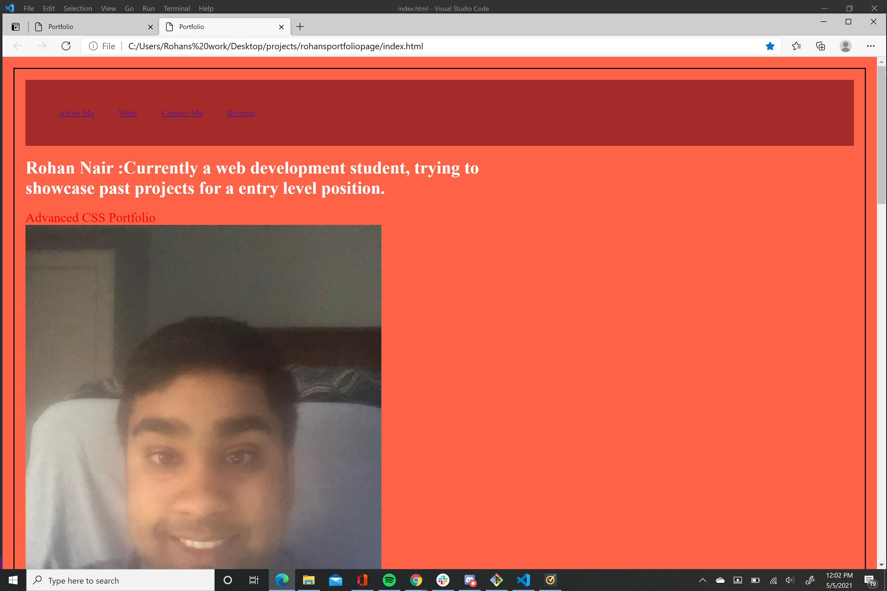
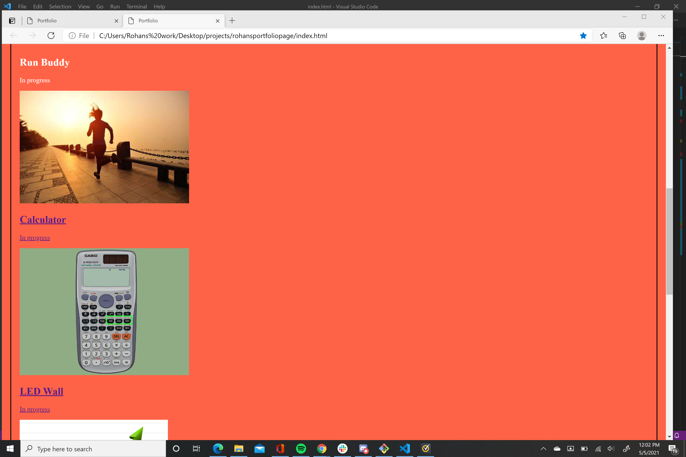
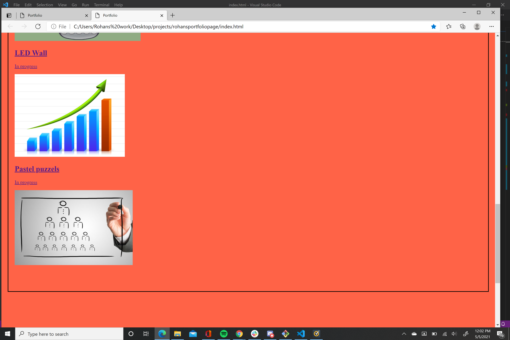
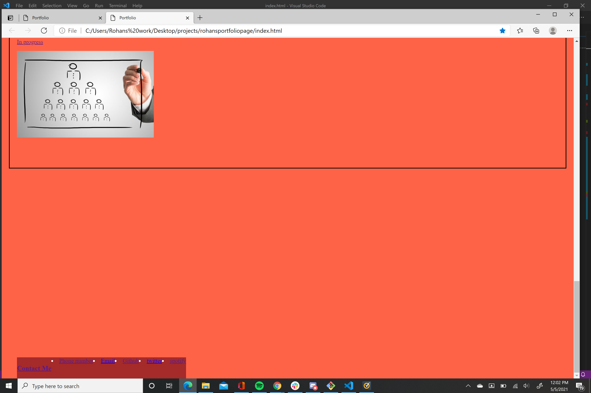

# rohansportfoliopage
Our task was to make a portfolio page. I was able to add an section which details my goals for the page, along with my name. I also added a contact me tag at the bottom of the page. I unfortunately could not cover up the blank white back ground of some of the page. Also I was not able to make the examples into two seperate rows. In addition I was unable to add an image to the surf report box. Most of the tools I used for this page were flexbox elements along with basic CSS elements.

Updated Readme- on resubmission- Added profile picture to page. Also made links responsive to different websites but most of links were deployed to github profile. I was also able to remove the "blank" or white parts of the profile page to make sure the entire page had some background color and was more readable.
Also included are screenshots of the deployed webpage.

